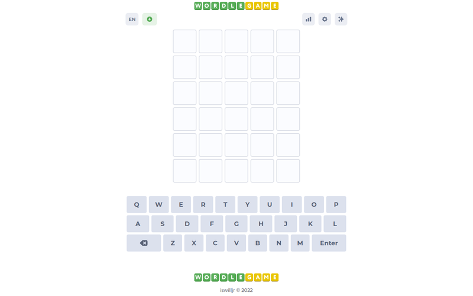
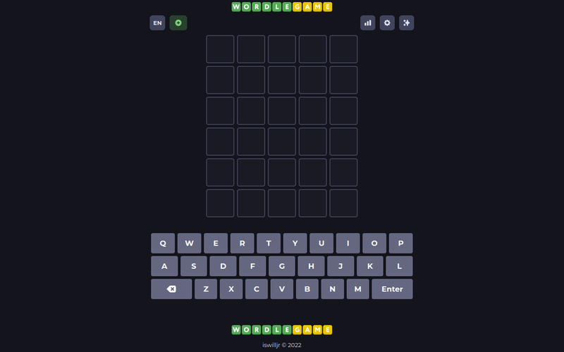

# Wordle Game: Guess the Hidden Word

This is a very simple clone of wordle game. The UI is taken from [wordlegame.org](https://wordlegame.org)

Visit the page and play [here](https://playwordle.vercel.app/favicon.png)

## Demo

It has Light and Dark mode

### Light Mode

### Dark Mode

## License

This project is [MIT licensed](./LICENSE).
